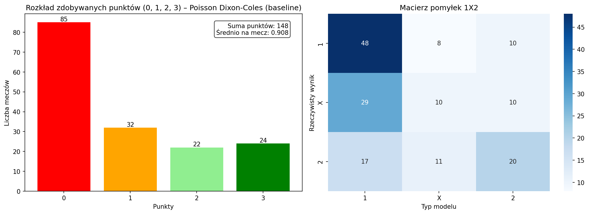
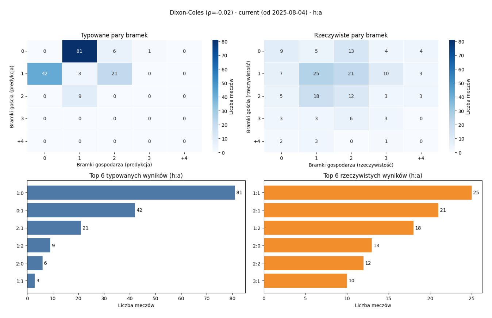

# +lucide:bar-chart-3+ API — `src.models.evaluation`

Uniwersalna punktacja Supertyper (3/2/1/0), metryki Poisson deviance,
sparowany t-test deviance oraz wizualizacje ewaluacji predykcji.

---

## Punktacja Supertyper

::: src.models.evaluation.ScoreRule

::: src.models.evaluation.score_single_prediction

::: src.models.evaluation.compute_points_per_match

::: src.models.evaluation.evaluate_score_predictions

## Poisson deviance

::: src.models.evaluation.evaluate_poisson_deviance

::: src.models.evaluation.compare_deviance_paired_ttest

## Wizualizacja predykcji

::: src.models.evaluation.PointsSummary1x2

::: src.models.evaluation.summarize_predictions_1x2

::: src.models.evaluation.plot_predictions_summary

example result of `plot_predictions_summary`:

::: src.models.evaluation.plot_predictions_scoreline_summary

example result of `plot_predictions_scoreline_summary`:

## PIT diagnostics

Probability Integral Transform (PIT) helpers for scoreline matrix calibration:
component extraction, randomized PIT replicates, summary statistics, and
plotting helpers.

::: src.models.evaluation.PITDistribution

::: src.models.evaluation.PITVariant

::: src.models.evaluation.PITDiagnosticsResult

::: src.models.evaluation.available_pit_variants

::: src.models.evaluation.get_pit_variant

::: src.models.evaluation.resolve_pit_variants

::: src.models.evaluation.build_pit_components

::: src.models.evaluation.randomized_pit_replicates_from_components

::: src.models.evaluation.summarize_pit_uniformity

::: src.models.evaluation.build_pit_diagnostics

::: src.models.evaluation.plot_pit_histogram_replicates

::: src.models.evaluation.plot_pit_worm_replicates

## Pearson chi-square diagnostics

Pearson chi-square helpers for scoreline goodness-of-fit on aggregated 4x4 bins
(`0, 1, 2, 3+` by home/away goals) with sparse-bin merge to `Other`.

`ddof` adjusts effective degrees of freedom (`dof = k_final - 1 - ddof`) and
should reflect parameter fitting performed on the same sample.

See also: [Przewodnik Pearson χ²](../guides/08-pearson-chi2-diagnostics.md).

::: src.models.evaluation.PearsonChi2ScorelineResult

::: src.models.evaluation.pearson_chi2_scoreline_gof
