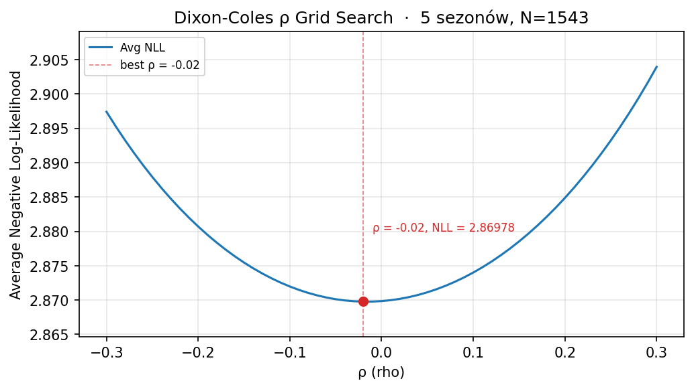

# +lucide:lightbulb+ Korekta Dixona-Colesa

Wyjaśnienie **co** robi korekta Dixona-Colesa, **dlaczego** jest potrzebna
w modelu Poissona dla piłki nożnej, oraz **jak** w tym projekcie dobiera się
parametr \(\rho\) — z porównaniem dwóch komplementarnych metod.

## 1. Problem: niezależność Poissona

Bazowy model scoreline zakłada, że liczba goli gospodarzy i gości to dwa
**niezależne** procesy Poissona z parametrami \(\lambda_{home}\) i \(\lambda_{away}\):

\[
P(X=x, Y=y) = \frac{\lambda_{home}^{x} e^{-\lambda_{home}}}{x!} \cdot
              \frac{\lambda_{away}^{y} e^{-\lambda_{away}}}{y!}
\]

Empiryczne rozkłady wyników pokazują jednak, że to założenie nie zachodzi dla
niskich wyników. Konkretnie: **czysty Poisson niedoszacowuje** remisy 0:0 i 1:1,
i **przeszacowuje** skromne zwycięstwa 1:0 i 0:1. Innymi słowy: gdy spodziewamy
się mało goli, drużyny częściej kończą na tym samym wyniku, niż przewiduje
niezależny Poisson.

## 2. Rozwiązanie: funkcja \(\tau(x,y)\)

Dixon i Coles (1997) zaproponowali mnożnikową korektę zależną od pojedynczego
parametru \(\rho\), stosowaną tylko do czterech komórek macierzy \(\{0,1\} \times \{0,1\}\):

\[
\tau(x,y) = \begin{cases}
1 - \lambda_{home}\lambda_{away}\rho & \text{dla } x=0, y=0 \\[3pt]
1 + \lambda_{home}\rho & \text{dla } x=0, y=1 \\[3pt]
1 + \lambda_{away}\rho & \text{dla } x=1, y=0 \\[3pt]
1 - \rho & \text{dla } x=1, y=1 \\[3pt]
1 & \text{w pozostałych przypadkach}
\end{cases}
\]

Ostateczne prawdopodobieństwo:

\[
P_{DC}(x,y) = P(x,y) \cdot \tau(x,y)
\]

### Intuicja \(\rho\)

- **\(\rho < 0\)**: \(\tau(0,0)\) i \(\tau(1,1)\) są > 1 (remisy podbite),
  \(\tau(0,1)\) i \(\tau(1,0)\) są < 1 (zwycięstwa 1:0 / 0:1 stonowane).
  Masa prawdopodobieństwa **przenosi się na niskie remisy**. To jest typowa
  wartość w projektach piłkarskich.
- **\(\rho = 0\)**: \(\tau \equiv 1\), brak korekty, czysty Poisson.
- **\(\rho > 0\)**: odwrotny kierunek — rzadko spotykane w praktyce.

### Typowa wartość w projekcie

Grid search 2D `(rho, bias_correction)` po `avg_points` przy
`odds_prefix="trimmed_avg"` na pełnych sezonach historycznych (siatka
\(\rho \in [-0.30, 0.02]\)) wskazuje optimum **w okolicy
\(\rho \approx -0.18\)** — patrz sekcja
[2D grid search](../guides/06-grid-search-and-tuning.md#3-2d-grid-search-dwa-parametry)
w guide. Wartość bez głębokiej kalibracji wspomniana w kodzie i docstringach
(np. `rho=-0.06` jako rozsądny default) **nie jest optymalna** — to tylko
konserwatywny punkt startowy.

## 3. Dwie metody dobrania \(\rho\) w tym projekcie

Projekt udostępnia **dwie niezależne drogi** do wyboru \(\rho\), robiące
różne rzeczy pod spodem. Oto porównanie.

### 3a. Kalibracja NLL — [`calibrate_rho`][src.models.components.calibrate_rho]

Dla każdego kandydata \(\rho\) budowana jest macierz DC, liczone jest
**średnie negatywne log-likelihood rzeczywistego wyniku** w danych, i wybierany
jest ten \(\rho\), dla którego NLL jest minimalny.

```python
from src.models import calibrate_rho, plot_rho_calibration

result = calibrate_rho(
    lambda_home=df["calibrated_lambda_home"].to_numpy(),
    lambda_away=df["calibrated_lambda_away"].to_numpy(),
    actual_home=df["home_score"].to_numpy(),
    actual_away=df["away_score"].to_numpy(),
    rho_range=(-0.30, 0.30),
    rho_step=0.01,
)
ax = plot_rho_calibration(result)
```



/// figure-caption
Rysunek 1. Kalibracja `rho` po średnim NLL rzeczywistego wyniku (model-agnostic).
///

Zwracany [`RhoCalibrationResult`][src.models.components.RhoCalibrationResult]
ma pola: `best_rho`, `best_nll`, `n_matches`, `grid_df`.

### 3b. Grid search po `avg_points` — [`run_predictive_grid_search`][src.models.tuning.run_predictive_grid_search]

Dla każdego kandydata \(\rho\) budowany jest `PoissonDixonColesModel`,
liczone są predykcje dla całego `df`, następnie punkty Supertypera — ranking
po `avg_points` (lub `total_points`, patrz
[guide grid search](../guides/06-grid-search-and-tuning.md#4-metryka-rankingowa-avg_points-vs-total_points-vs-wasna)).

```python
param_grid = build_param_grid(
    {"rho": {"start": -0.30, "stop": 0.02, "step": 0.02}}
)

def model_factory(**params):
    return PoissonDixonColesModel(**params, use_over25_interpolation=True)

search = run_predictive_grid_search(
    model_factory=model_factory,
    param_grid=param_grid,
    df=df,
    score_key="avg_points",
)
ax = plot_grid_search_1d(
    search.results_df,
    param_name="rho",
    metric_name="avg_points",
)
```


/// figure-caption
Rysunek 2. 1D grid search `rho` rankowany po `avg_points` (pipeline: `PoissonDixonColesModel` + `evaluate_score_predictions`).
///

## 4. Użycie \(\rho\) w `PoissonDixonColesModel`

Docelowo `rho` jest parametrem modelu:

```python
from src.models import PoissonDixonColesModel

model = PoissonDixonColesModel(
    rho=-0.18,
    bias_correction=1.08,
    use_over25_interpolation=True,
)
pred_df = model.predict(df)
```

Wewnętrznie model:

1. Buduje [`PoissonMatrixBuilder`][src.models.components.PoissonMatrixBuilder] z parametrem `rho`.
2. Dla każdego meczu generuje **znormalizowaną** macierz prawdopodobieństw wyników `(x, y)`.
3. Wybiera typ maksymalizujący oczekiwane punkty Supertypera (`pred_xpts`) przez
   [`ExpectedPointsOptimizer`][src.models.components.ExpectedPointsOptimizer] —
   wzór i intuicja: [Oczekiwane punkty i wybór wyniku](expected-points-optimization.md).

## 5. Cross-refs do API

- [`calibrate_rho`][src.models.components.calibrate_rho]
- [`plot_rho_calibration`][src.models.components.plot_rho_calibration]
- [`RhoCalibrationResult`][src.models.components.RhoCalibrationResult]
- [`PoissonMatrixBuilder`][src.models.components.PoissonMatrixBuilder]
- [`PoissonDixonColesModel`][src.models.statistical.PoissonDixonColesModel]
- [`run_predictive_grid_search`][src.models.tuning.run_predictive_grid_search]
