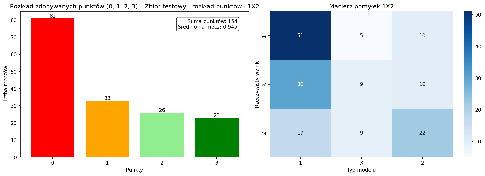

# +lucide:gauge+ Ewaluacja predykcji

Moduł [`src.models.evaluation`](../api/evaluation.md) jest **niezależny od
modelu**: dostajesz `pred_df` z kolumnami typu `pred_home_goals` /
`pred_away_goals` i porównujesz z rzeczywistym wynikiem (`home_score`,
`away_score`).

Intuicja punktów: [Zasady punktacji](../concepts/scoring-rules.md).

Implementacja w repo: `src/models/evaluation/scoring.py` (m.in.
`evaluate_score_predictions`, `evaluate_poisson_deviance`,
`compare_deviance_paired_ttest`, `ScoreRule`) oraz
`src/models/evaluation/visualization.py` (`summarize_predictions_1x2`,
`PointsSummary1x2`, `plot_predictions_summary`,
`plot_predictions_scoreline_summary`). Pełne sygnatury:
[API evaluation](../api/evaluation.md).

## Co pokazuje `plot_predictions_summary`

Funkcja [`plot_predictions_summary`][src.models.evaluation.plot_predictions_summary]
buduje **dwa panele** na podstawie tego samego `pred_df`:

1. **Lewy:** histogram liczby meczów vs **punktów Supertypera** (0–3) — to
   wizualizacja tego, co liczy [`evaluate_score_predictions`][src.models.evaluation.evaluate_score_predictions]
   (średnia tych punktów to m.in. `avg_points`).
2. **Prawy:** **macierz 1X2** (rzeczywisty wynik × wynik „wywnioskowany” z
   predykowanego scoreline) — ten sam układ co `summary.outcome_matrix` z
   [`summarize_predictions_1x2`][src.models.evaluation.summarize_predictions_1x2].

Dzięki temu jednym wywołaniem widzisz zarówno „ile punktów zbieram”, jak i
„gdzie mylę się na 1X2”.

Minimalne wywołanie (zwraca [`matplotlib.figure.Figure`][src.models.evaluation.plot_predictions_summary]
— w notatniku Marimo / Jupyter figurę zwykle wyświetlasz jako ostatnią wartość
komórki albo przez `mo.output.append(fig)`):

```python
from src.models import plot_predictions_summary

fig = plot_predictions_summary(
    pred_df,
    model_name="Poisson Dixon-Coles (baseline)",
)
fig
```

### Przykład na tym samym zbiorze holdout (163 mecze)

Poniższe figury pochodzą z notatników (ten sam **zbiór testowy / holdout** —
wycinek sezonu `current`, bez udziału w strojeniu hiperparametrów): baseline
`PoissonDixonColesModel` w
`notebooks/reports/poisson_dixon_coles_baseline.py` oraz finalny XGB w
`notebooks/exploration/01_xgboost_poisson_prototype.py`. Żeby porównywać modele
uczciwie, **użyj identycznego zbioru wierszy** (`pred_df` z tymi samymi
`match_date` / `match_link`).


/// figure-caption
Rysunek 1. Baseline Poisson Dixon–Coles na holdoucie: rozkład punktów 0–3 oraz
macierz pomyłek 1X2 (łącznie 163 mecze; `avg_points` ≈ 148/163 ≈ 0,91).
///



/// figure-caption
Rysunek 2. Ten sam zbiór testowy: model XGB z
`01_xgboost_poisson_prototype.py` — wyższa suma i średnia punktów (`avg_points`
≈ 154/163 ≈ 0,95) przy podobnej strukturze błędów na remisach.
///

## `plot_predictions_scoreline_summary` — mapa par bramek i top wyników

[`plot_predictions_scoreline_summary`][src.models.evaluation.plot_predictions_scoreline_summary]
to osobna figura **2×2** (matplotlib): **górny rząd** — dwie heatmapy częstości par
(bramki gospodarza × gość) dla predykcji i dla faktów; wartości od **0** do
**`max_goals_clip`** (domyślnie 4), przy czym na osi ostatni kubełek jest oznaczony
**`+4`** (zgrubszenie „4 lub więcej bramek”). **Dolny rząd** — poziome słupki z
**najczęstszymi pełnymi scoreline’ami** `h:a` (bez ścięcia — osobno dla typów i
dla rzeczywistości). Do wizualizacji trafiają tylko wiersze, w których po konwersji
do liczb wszystkie cztery pola (`pred_*` i fakty) są **skończone** (`dropna`).

```python
from src.models import plot_predictions_scoreline_summary

fig = plot_predictions_scoreline_summary(
    pred_df,
    model_name="Poisson Dixon–Coles — scoreline",
)
fig
```


/// figure-caption
Rysunek 3. Przykład z laboratorium Dixon–Coles / kalibracji Poissona: jak rozłożone są
typowane vs rzeczywiste pary bramek (heatmapy wspólna skala kolorów) oraz jakie
`h:a` pojawiają się najczęściej w próbce (dolne panele).
///

## Podstawowe metryki (programowo) — `evaluate_score_predictions`

Zwraca **jeden słownik** z metrykami zagregowanymi po meczach, na których da
się policzyć punkty (wiersze z `NaN` w którejkolwiek z wymaganych kolumn są
**pomijane**, tak jak w [`compute_points_per_match`][src.models.evaluation.compute_points_per_match]).

| Parametr | Znaczenie |
| --- | --- |
| `df` | `DataFrame` z kolumnami predykcji i faktów. |
| `pred_home_col`, `pred_away_col` | Kolumny przewidywanych goli (wartości są **zaokrąglane do int** przed scoringiem). |
| `actual_home_col`, `actual_away_col` | Rzeczywiste gole. |
| `rule` | Opcjonalny [`ScoreRule`][src.models.evaluation.ScoreRule] (domyślnie 3 / 2 / 1 / 0 pkt). |

**Zwracany `dict[str, Any]`** — klucze stałe, typy przykładowe:

| Klucz | Typ | Znaczenie |
| --- | --- | --- |
| `matches_evaluated` | `int` | Liczba meczów po `dropna`. |
| `total_points` | `int` | Suma punktów Supertypera. |
| `avg_points` | `float` | `total_points / matches_evaluated`. |
| `exact_hit_rate` | `float` | Ułamek meczów z dokładnym wynikiem (0–1). |
| `goal_diff_hit_rate` | `float` | Trafiona różnica bramek, bez pełnego trafienia. |
| `outcome_hit_rate` | `float` | Tylko trafione 1X2 (bez wyższych tierów). |
| `miss_rate` | `float` | Reszta (0 pkt). |

Gdy po oczyszczeniu nie ma żadnego wiersza, dostajesz m.in.
`matches_evaluated: 0`, `total_points: 0`, a `avg_points` oraz wskaźniki
`exact_hit_rate`, `goal_diff_hit_rate`, `outcome_hit_rate`, `miss_rate` są `nan`.

```python
from src.models import evaluate_score_predictions

metrics = evaluate_score_predictions(
    pred_df,
    pred_home_col="pred_home_goals",
    pred_away_col="pred_away_goals",
    actual_home_col="home_score",
    actual_away_col="away_score",
)
# przykładowy kształt:
# {
#     "matches_evaluated": 163,
#     "total_points": 154,
#     "avg_points": 0.9448...,
#     "exact_hit_rate": 0.1411...,
#     ...
# }
```

## Tabela 1X2 i rozkład punktów — `summarize_predictions_1x2`

Zwraca **dataclass** [`PointsSummary1x2`][src.models.evaluation.PointsSummary1x2]
(obiekt z polami, nie słownik). Używa tych samych kolumn i reguły co
`evaluate_score_predictions`.

| Pole | Typ | Jak to wygląda |
| --- | --- | --- |
| `total_points` | `float` | Suma punktów po meczach (jak w słowniku powyżej). |
| `mean_points` | `float` | Średnia punktów (= `avg_points` przy tym samym zbiorze wierszy). |
| `points_distribution` | `pd.Series` | Indeks: wartość punktowa (0, 1, 2, 3, …); wartości: **liczba meczów** z tą liczbą punktów (`value_counts`, posortowane). |
| `outcome_matrix` | `pd.DataFrame` | **Macierz pomyłek 1X2**: indeks = rzeczywisty wynik (`"1"`, `"X"`, `"2"`), kolumny = wynik z predykowanego scoreline; komórki = liczby meczów (zawsze 3×3, braków jest 0). |

Przy braku danych po `dropna`: puste `Series` / `DataFrame`, `total_points=0`,
`mean_points=nan`.

```python
from src.models import summarize_predictions_1x2

summary = summarize_predictions_1x2(pred_df)
# summary.outcome_matrix → np. wiersz "1" / kolumna "X" = ile razy był remis, a model typował gospodarza
```

## Poisson deviance (na lambdach) — `evaluate_poisson_deviance`

**Wejście:** cztery **jednowymiarowe** tablice tej samej długości \(n\) (wektory
po meczach): obserwowane gole i przewidywane \(\lambda\) Poissona (np.
`calibrated_lambda_*`). Nie przyjmuje `DataFrame` — podajesz `numpy` / listy.

**Zwracany `dict[str, Any]`:**

| Klucz | Typ | Znaczenie |
| --- | --- | --- |
| `Deviance_home` | `float` | Średnia deviance Poissona dla **gospodarza** (zaokr. 4 miejsca). |
| `SE_home` | `float` | Błąd standardowy średniej (/\(\sqrt{n}\)). |
| `Deviance_away` | `float` | Jak wyżej dla gości. |
| `SE_away` | `float` | |
| `Deviance_mean` | `float` | Średnia z **(dev_home + dev_away) / 2** per mecz. |
| `SE_mean` | `float` | SE tej średniej po meczach. |
| `Error_Vector` | `list[float]` | Długość **\(2n\)**: najpierw \(n\) deviacji home (kolejność meczów), potem \(n\) deviacji away — pod [`compare_deviance_paired_ttest`][src.models.evaluation.compare_deviance_paired_ttest] podajesz **dwa takie same wektory** z porównywalnych splitów. |

```python
from src.models import evaluate_poisson_deviance

metrics = evaluate_poisson_deviance(
    y_true_home=df_val["home_score"].to_numpy(),
    y_pred_home=df_val["calibrated_lambda_home"].to_numpy(),
    y_true_away=df_val["away_score"].to_numpy(),
    y_pred_away=df_val["calibrated_lambda_away"].to_numpy(),
)
# len(metrics["Error_Vector"]) == 2 * len(df_val)
```

## Sparowany test — `compare_deviance_paired_ttest`

Porównuje **parowany** rozkład deviacji (ta sama kolejność obserwacji w obu
wektorach). **Niższa** średnia deviance = lepszy model.

| Parametr | Znaczenie |
| --- | --- |
| `current_vector` | Zwykle `metrics["Error_Vector"]` **nowego** modelu. |
| `best_vector` | `Error_Vector` **bazowego** modelu (ta sama liczba elementów). |
| `alpha` | Poziom istotności (domyślnie `0.05`). |

**Zwracany `dict[str, Any]`:**

| Klucz | Znaczenie |
| --- | --- |
| `statistic` | Statystyka `ttest_rel`. |
| `pvalue` | \(p\)-wartość testu dwustronnego. |
| `alpha` | Przekazany poziom. |
| `mean_current`, `mean_best` | Średnie po całych wektorach (średnia deviance „spłaszczonego” wektora \(2n\) obserwacji). |
| `comparison_status` | Jedna z: `"better_significant"`, `"better_not_significant"`, `"worse"`, `"error"` (np. różna długość wektorów). |
| `message` | Krótki opis werdyktu po angielsku (z kodu). |

```python
from src.models import compare_deviance_paired_ttest

result = compare_deviance_paired_ttest(
    current_vector=metrics_new["Error_Vector"],
    best_vector=metrics_baseline["Error_Vector"],
    alpha=0.05,
)
# result["comparison_status"], result["pvalue"], result["mean_current"], ...
```

## Zobacz też

- [API evaluation](../api/evaluation.md)
- [Grid search i tuning](06-grid-search-and-tuning.md) — wybór `score_key` / `metric_fn`
