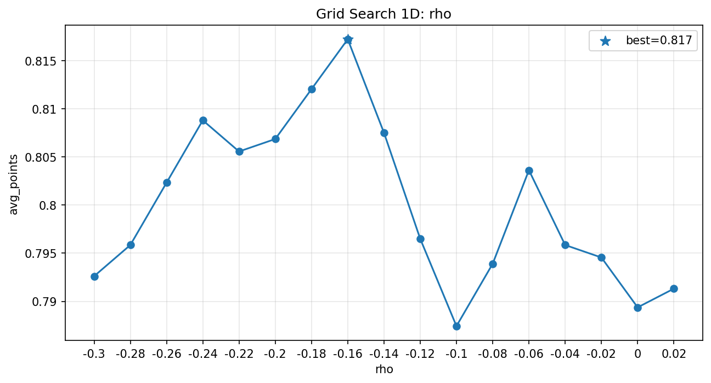
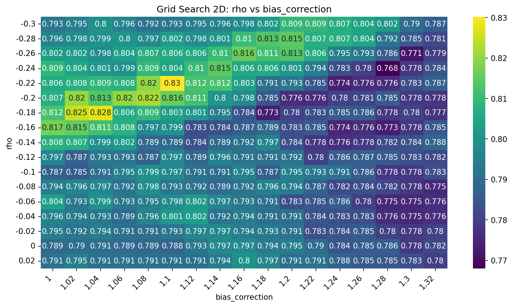
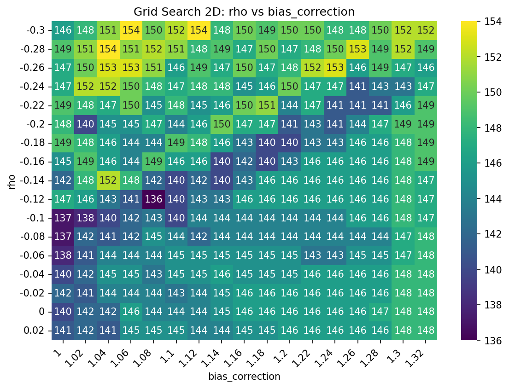

# +lucide:sliders-horizontal+ Grid search i tuning

Przewodnik po tuningu modeli w projekcie. Pokrywa:

- 1D i 2D grid search dla modeli **non-trainable** (`PoissonDixonColesModel`
  i podobne),
- wybór metryki rankingowej (`avg_points` vs `total_points` vs metryka własna),
- cache wyników między uruchomieniami,
- trainable grid search dla modeli typu `XGBoostPoissonModel` z **walk-forward
  po sezonach** (`train` / `val` / `eval` — patrz
  [Walidacja sezonowa](../concepts/season-walk-forward-validation.md)).

## 1. Schemat pracy

<figure role="group" aria-label="Pipeline grid searcha">
<svg xmlns="http://www.w3.org/2000/svg" viewBox="0 0 980 290" style="max-width:100%;height:auto;display:block;margin:1rem auto;" role="img" aria-labelledby="gs-title gs-desc">
  <title id="gs-title">Pipeline grid searcha w projekcie football-data</title>
  <desc id="gs-desc">Dane z kursami trafiają do funkcji dodającej prawdopodobieństwa implikowane, następnie do grid searcha wraz z modelem z model_factory, a wynik idzie do funkcji wizualizującej.</desc>
  <defs>
    <marker id="gs-arrow" viewBox="0 0 10 10" refX="9" refY="5" markerWidth="7" markerHeight="7" orient="auto-start-reverse">
      <path d="M0,0 L10,5 L0,10 z" fill="currentColor"/>
    </marker>
  </defs>
  <g font-family="ui-sans-serif, system-ui, -apple-system, Segoe UI, sans-serif" font-size="13" fill="currentColor" stroke="currentColor">
    <g>
      <rect x="20" y="40" width="180" height="70" rx="8" ry="8" fill="currentColor" fill-opacity="0.04" stroke-width="1.5"/>
      <text x="110" y="72" text-anchor="middle" stroke="none">Dane z kursami</text>
      <text x="110" y="92" text-anchor="middle" stroke="none" opacity="0.75" font-size="12">(trimmed_avg / avg / max)</text>
    </g>
    <g>
      <rect x="230" y="40" width="240" height="70" rx="8" ry="8" fill="currentColor" fill-opacity="0.04" stroke-width="1.5"/>
      <text x="350" y="72" text-anchor="middle" stroke="none">Prawdopodobieństwa</text>
      <text x="350" y="92" text-anchor="middle" stroke="none" font-family="ui-monospace, SFMono-Regular, Menlo, Consolas, monospace" font-size="11" opacity="0.85">add_power_implied_probabilities_*</text>
    </g>
    <g>
      <rect x="500" y="40" width="300" height="70" rx="8" ry="8" fill="currentColor" fill-opacity="0.04" stroke-width="1.5"/>
      <text x="650" y="66" text-anchor="middle" stroke="none" font-family="ui-monospace, SFMono-Regular, Menlo, Consolas, monospace" font-size="12">run_predictive_grid_search</text>
      <text x="650" y="82" text-anchor="middle" stroke="none" opacity="0.75" font-size="11">lub</text>
      <text x="650" y="99" text-anchor="middle" stroke="none" font-family="ui-monospace, SFMono-Regular, Menlo, Consolas, monospace" font-size="11">run_trainable_grid_search_three_way</text>
    </g>
    <g>
      <rect x="830" y="40" width="130" height="70" rx="8" ry="8" fill="currentColor" fill-opacity="0.04" stroke-width="1.5"/>
      <text x="895" y="72" text-anchor="middle" stroke="none" font-family="ui-monospace, SFMono-Regular, Menlo, Consolas, monospace" font-size="11">plot_grid_search_</text>
      <text x="895" y="90" text-anchor="middle" stroke="none" font-family="ui-monospace, SFMono-Regular, Menlo, Consolas, monospace" font-size="11">1d / 2d</text>
    </g>
    <g>
      <rect x="500" y="190" width="300" height="70" rx="8" ry="8" fill="currentColor" fill-opacity="0.04" stroke-width="1.5"/>
      <text x="650" y="218" text-anchor="middle" stroke="none" font-family="ui-monospace, SFMono-Regular, Menlo, Consolas, monospace" font-size="12">model_factory(**params)</text>
      <text x="650" y="240" text-anchor="middle" stroke="none" font-size="12">→ PoissonDixonColesModel</text>
    </g>
    <line x1="200" y1="75" x2="228" y2="75" stroke-width="1.5" marker-end="url(#gs-arrow)" fill="none"/>
    <line x1="470" y1="75" x2="498" y2="75" stroke-width="1.5" marker-end="url(#gs-arrow)" fill="none"/>
    <line x1="800" y1="75" x2="828" y2="75" stroke-width="1.5" marker-end="url(#gs-arrow)" fill="none"/>
    <line x1="650" y1="190" x2="650" y2="112" stroke-width="1.5" marker-end="url(#gs-arrow)" fill="none"/>
  </g>
</svg>
<figcaption style="text-align:center;font-size:0.9em;opacity:0.75;margin-top:-0.25rem;">Rysunek 0. Pipeline tuningu: dane z kursami → prawdopodobieństwa implikowane → grid search (zasilany przez <code>model_factory</code>) → wizualizacja wyników.</figcaption>
</figure>

`model_factory` to **funkcja tworząca model z dowolnej kombinacji parametrów**
z grid. Używa wszystkich parametrów, które chcesz przeszukać, jako argumentów
nazwanych. Przykład:

```python
def model_factory(**params):
    return PoissonDixonColesModel(**params, use_over25_interpolation=True)
```

## 2. 1D grid search — jeden parametr

Przypadek najprostszy: stroić tylko `rho`, resztę trzymać na defaulcie.

```python
from src.data import load_and_add_odds_columns_compact
from src.features import add_power_implied_probabilities_standard_markets
from src.models import (
    PoissonDixonColesModel,
    build_param_grid,
    plot_grid_search_1d,
    run_predictive_grid_search,
)

df = load_and_add_odds_columns_compact()
df = df[df["season"] != "current"]
df = add_power_implied_probabilities_standard_markets(
    df,
    odds_prefix="trimmed_avg",
)

param_grid = build_param_grid(
    {"rho": {"start": -0.30, "stop": 0.02, "step": 0.02}}
)

def model_factory(**params):
    return PoissonDixonColesModel(**params, use_over25_interpolation=True)

search = run_predictive_grid_search(
    model_factory=model_factory,
    param_grid=param_grid,
    df=df,
    cache_mode="off",
)

ax = plot_grid_search_1d(
    search.results_df,
    param_name="rho",
    metric_name="avg_points",
)
```

Wynik (na kompletnych sezonach historycznych):



/// figure-caption
Rysunek 1. 1D grid search `rho` dla `PoissonDixonColesModel` na pełnych sezonach historycznych, ranking po `avg_points` (trimmed_avg).
///

Widać wyraźne maksimum `avg_points` w okolicy `rho ≈ -0.16`, co pokrywa się
z interpretacją korekty Dixona-Colesa przenoszącej masę prawdopodobieństwa na
remisy 0:0 i 1:1 (szczegóły w [Korekta Dixona-Colesa](../concepts/dixon-coles-correction.md)).

!!! tip "`build_param_grid` — zakres zamiast listy"
    Zamiast `{"rho": [-0.30, -0.28, -0.26, ...]}` możesz podać słownik
    `{"start": ..., "stop": ..., "step": ...}` (lub `num` dla linspace). Krok
    jest **inkluzywny** — `stop` jest w siatce.

Więcej w API: [`run_predictive_grid_search`][src.models.tuning.run_predictive_grid_search],
[`plot_grid_search_1d`][src.models.tuning.plot_grid_search_1d].

## 3. 2D grid search — dwa parametry

Gdy stroisz np. `rho` i `bias_correction` jednocześnie (typowy setup
w notatnikach raportowych):

```python
param_grid = build_param_grid({
    "rho": {"start": -0.30, "stop": 0.02, "step": 0.02},
    "bias_correction": {"start": 1.00, "stop": 1.32, "step": 0.02},
})

search = run_predictive_grid_search(
    model_factory=model_factory,
    param_grid=param_grid,
    df=df,
    cache_mode="use",
)

from src.models import plot_grid_search_2d
ax = plot_grid_search_2d(
    search.results_df,
    x_param="bias_correction",
    y_param="rho",
    metric_name="avg_points",
)
```



/// figure-caption
Rysunek 2. 2D grid search `(rho, bias_correction)` po `avg_points`, kursy `trimmed_avg`, pełne sezony historyczne.
///

Więcej w API: [`plot_grid_search_2d`][src.models.tuning.plot_grid_search_2d].

## 4. Metryka rankingowa — `avg_points` vs `total_points` vs własna

`run_predictive_grid_search` domyślnie rankuje po `score_key="avg_points"`.
Pole `score_key` może przyjąć dowolny klucz numeryczny zwracany przez
[`evaluate_score_predictions`][src.models.evaluation.evaluate_score_predictions]
(m.in. `avg_points`, `total_points`, `exact_hit_rate`, `goal_diff_hit_rate`,
`outcome_hit_rate`, `miss_rate`).

### Przykład: ranking po `total_points`

Sensowny, gdy rankujesz na **krótszym oknie**, np. na bieżącym sezonie
z ograniczoną liczbą meczów (porównujesz bezpośrednio z innymi graczami
Supertypera w tabeli):

```python
search_current = run_predictive_grid_search(
    model_factory=model_factory,
    param_grid=param_grid,
    df=df_current_season,
    score_key="total_points",
    cache_mode="use",
)
ax = plot_grid_search_2d(
    search_current.results_df,
    x_param="bias_correction",
    y_param="rho",
    metric_name="total_points",
)
```



/// figure-caption
Rysunek 3. 2D grid search po `total_points` na bieżącym sezonie - inne optimum niż przy `avg_points` na historii.
///

### Kiedy którą metrykę

| Metryka | Kiedy używać | Uwagi |
| --- | --- | --- |
| `avg_points` | Rankowanie na pełnych sezonach historycznych (stabilna, niezależna od liczby meczów). | Default. Bezpieczny wybór dla tuningu. |
| `total_points` | Rankowanie na ograniczonym oknie (np. bieżący sezon) gdy zależy Ci na bezpośrednim porównaniu z tabelą Supertypera. | Uważaj: skaluje się z liczbą meczów. |
| `exact_hit_rate`, `goal_diff_hit_rate`, `outcome_hit_rate` | Diagnostyka modelu — które poziomy trafień dominują. | Nie wszystkie metryki punktują tak samo, więc ranking może się różnić. |
| `metric_fn` (callback) | Metryka niestandardowa, np. ważona regułą "tylko mecze powyżej X-tej kolejki". | Parametr `metric_fn` ma pierwszeństwo nad `score_key`. |

### Własna metryka (`metric_fn`)

```python
def penalize_miss_rate(metrics: dict) -> float:
    return metrics["avg_points"] - 0.5 * metrics["miss_rate"]

search = run_predictive_grid_search(
    model_factory=factory,
    param_grid=param_grid,
    df=df,
    metric_fn=penalize_miss_rate,
)
```

## 5. Cache

Grid search bywa drogi (kombinacje × predykcje). `cache_mode` kontroluje
zachowanie:

| `cache_mode` | Zachowanie | Kiedy używać |
| --- | --- | --- |
| `"off"` | Nie czyta i nie zapisuje cache. | Domyślne; krótkie eksperymenty. |
| `"use"` | Jeśli cache istnieje → zwróć zapisany wynik; jeśli nie → policz i zapisz. | Iteracyjna praca w notatnikach. |
| `"refresh"` | Zawsze policz od nowa i nadpisz cache. | Po zmianie danych/logiki modelu. |

Klucz cache buduje się z nazwy `model_factory`, `param_grid`, `score_key`,
nazw kolumn prediction/actual, i fingerprintu DataFrame. Zmiana któregokolwiek
z nich → nowy plik cache (oryginał nadal istnieje).

```python
search = run_predictive_grid_search(
    model_factory=model_factory,
    param_grid=param_grid,
    df=df,
    cache_mode="use",
    cache_dir="outputs/reports/grid_search_cache", # default
    model_name="pdc_trimmed_avg", # stable key across runs
)
```

!!! warning "Kiedy `cache_mode='use'` może Cię zmylić"
    Jeśli zmienisz feature engineering "w miejscu" (nadpiszesz kolumny w `df`
    bez zmiany ich nazw), a `data_fingerprint_columns=None`, fingerprint
    policzy się ze **wszystkich** kolumn i cache trafi się poprawnie. Ale jeśli
    podasz `data_fingerprint_columns=["match_link"]`, fingerprint ignoruje
    zmiany w kolumnach kursów → stary cache mimo zmian. Rozwiązanie:
    `cache_mode="refresh"` albo zmiana `model_name`.

## 6. Trainable grid search (sezonowy walk-forward)

Gdy model **uczy się** (`XGBoostPoissonModel`, inne `TrainablePredictiveModel`),
używamy podziału **po sezonach**: starsze sezony na trening, kolejny sezon na
walidację w trakcie uczenia (np. early stopping), **osobny** sezon wyłącznie na
metryki rankingu hiperparametrów. Dzięki temu zbiór `val` nie „wycieka” do
oceny końcowej folda (więcej w
[Walidacja sezonowa](../concepts/season-walk-forward-validation.md)).

```python
from src.models.tuning import (
    make_season_walk_forward_splits,
    run_trainable_grid_search_three_way,
)

historical_df = df[df["season"].isin(historical_seasons)].copy()
folds = make_season_walk_forward_splits(
    historical_df,
    season_col="season",
    seasons_order=historical_seasons,
)

search = run_trainable_grid_search_three_way(
    model_factory=trainable_model_factory,
    param_grid={"learning_rate": [0.02, 0.025, 0.03]},
    df=historical_df,
    folds=folds,
    datetime_col="match_date",
    score_key="avg_points",
    cache_mode="off",
)
```

W każdym foldzie: `fit(train_df, eval_df=val_df)` (val = early stopping),
`predict(eval_df)` → metryki tylko na `eval_df` (następny sezon).

### 6.1. Porównanie z predictive grid search

| Wariant | Podział danych | Metryki na |
| --- | --- | --- |
| `run_predictive_grid_search` | Brak splitów — model nie trenuje | całe `df` |
| `run_trainable_grid_search_three_way` | [`make_season_walk_forward_splits`][src.models.tuning.make_season_walk_forward_splits] — train / val / eval po sezonach | tylko `eval_df` (osobny sezon) |

## 7. Warianty funkcji — kiedy którą

| Funkcja | Model | Kiedy użyć |
| --- | --- | --- |
| [`run_predictive_grid_search`][src.models.tuning.run_predictive_grid_search] | Non-trainable (`PoissonDixonColesModel`) | Model statystyczny bez uczenia; parametry typu `rho`, `bias_correction`. |
| [`run_trainable_grid_search_three_way`][src.models.tuning.run_trainable_grid_search_three_way] | Trainable (`XGBoostPoissonModel` z early stopping) | Grid po sezonach; `fit(..., eval_df=val_df)` + metryki na osobnym sezonie eval. |

## 8. Cross-refs do API

- [`build_param_grid`][src.models.tuning.build_param_grid]
- [`GridSearchResult`][src.models.tuning.GridSearchResult]
- [`plot_grid_search_1d`][src.models.tuning.plot_grid_search_1d]
- [`plot_grid_search_2d`][src.models.tuning.plot_grid_search_2d]
- [`run_predictive_grid_search`][src.models.tuning.run_predictive_grid_search]
- [`run_trainable_grid_search_three_way`][src.models.tuning.run_trainable_grid_search_three_way]
- [`SeasonWalkForwardFold`][src.models.tuning.SeasonWalkForwardFold]
- [`make_season_walk_forward_splits`][src.models.tuning.make_season_walk_forward_splits]
- [`evaluate_score_predictions`][src.models.evaluation.evaluate_score_predictions] (źródło metryk)
