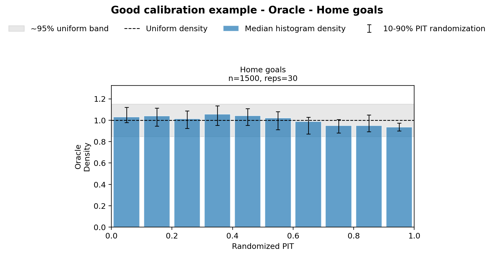
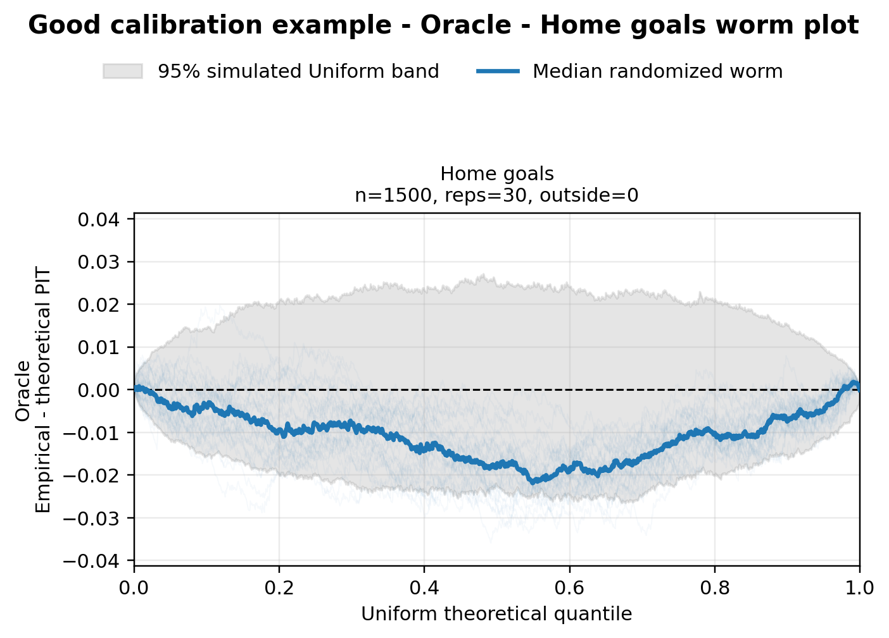
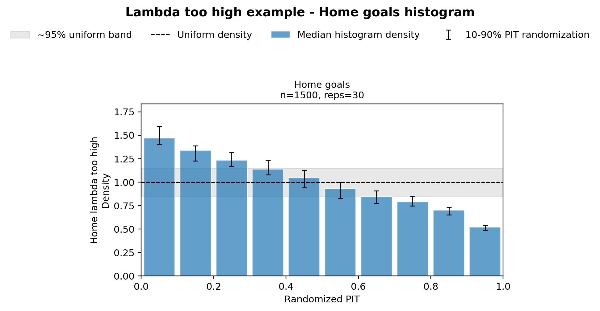
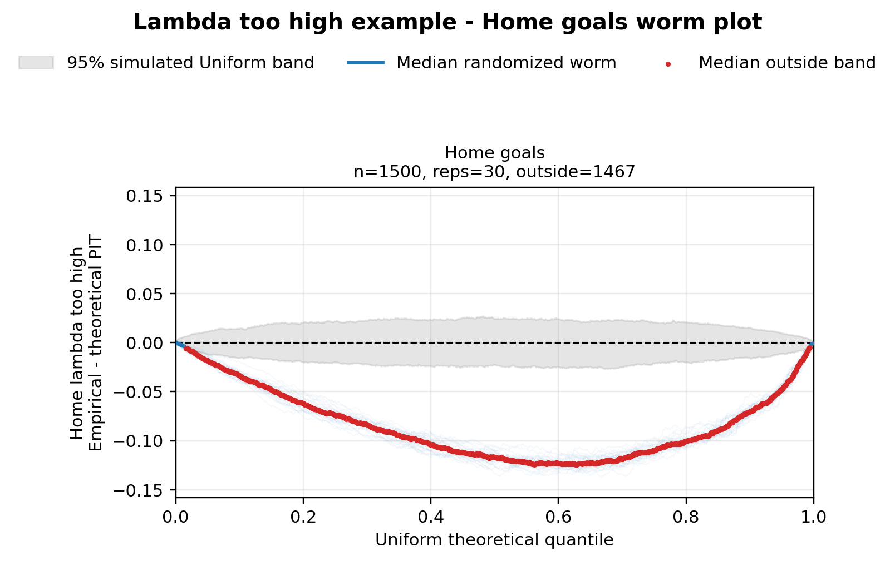
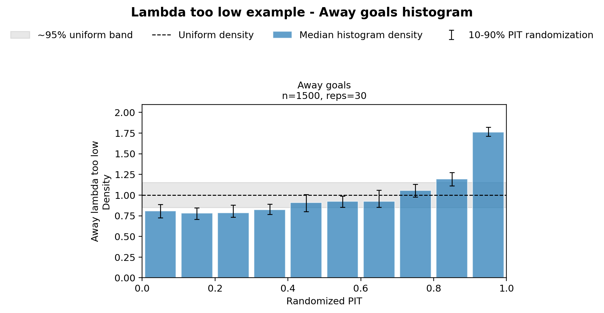
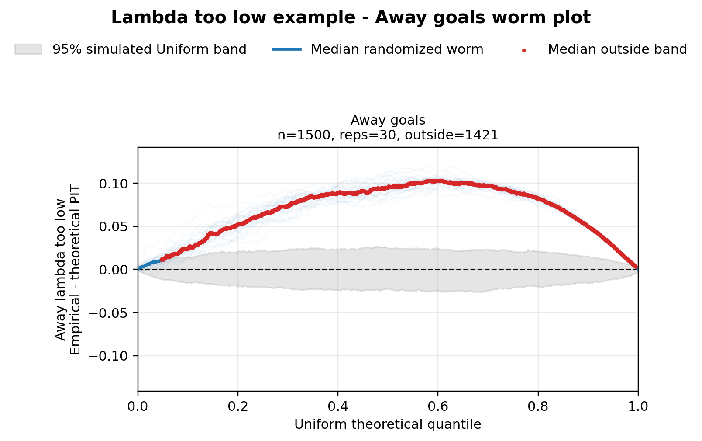
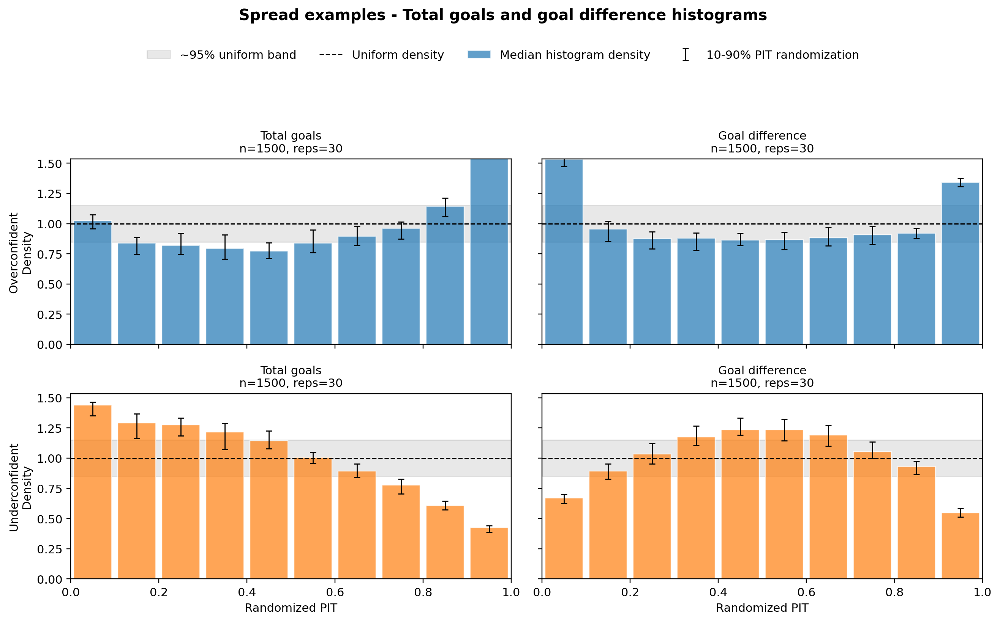
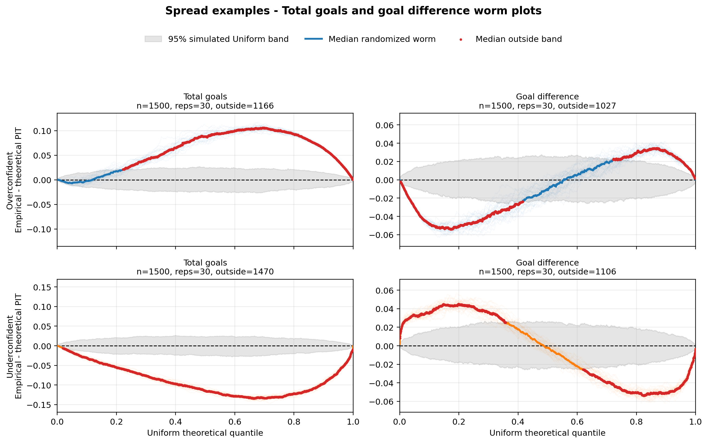

# +lucide:chart-spline+ Interpretacja PIT i worm plot

Ten przewodnik pokazuje, jak czytać wykresy z notatnika
`notebooks/exploration/04_PIT_Diagnostics_Simulation_Lab.py` na prostych,
kontrolowanych przypadkach. Celem jest wytrenowanie intuicji:

- co wygląda jak dobra kalibracja,
- jak rozpoznać zawyżone / zaniżone \(\lambda\),
- jak odróżnić overconfidence od underconfidence.

!!! info "Uwaga o interpretacji"
    Pojedynczy wykres nigdy nie daje pełnego obrazu. Traktuj histogram PIT i
    worm plot jako parę: histogram pokazuje rozkład masy, a worm plot kierunek
    i kształt odchyleń od rozkładu jednostajnego.

## Jak działa PIT w tym projekcie

Dla każdej obserwacji masz rozkład dyskretny (z macierzy scoreline), więc PIT
nie jest pojedynczą wartością ciągłą jak w modelu Gaussowskim. W praktyce
liczymy randomized PIT:

\[
U = F(y^-) + V \cdot P(Y=y), \qquad V \sim \mathcal{U}(0, 1)
\]

gdzie:

- \(F(y^-)\) to masa prawdopodobieństwa poniżej wartości obserwowanej,
- \(P(Y=y)\) to masa dokładnie w punkcie obserwowanym,
- \(V\) losuje pozycję wewnątrz „schodka” CDF dla danych dyskretnych.

Jeśli model jest dobrze skalibrowany, rozkład \(U\) powinien być bliski
jednostajnemu na \([0, 1]\). W tym repo komponenty PIT są budowane w
[`build_pit_components`][src.models.evaluation.build_pit_components], a
replikaty randomizacji w
[`randomized_pit_replicates_from_components`][src.models.evaluation.randomized_pit_replicates_from_components].

## Jak jest robiony QQ worm plot

Worm plot to QQ-plot PIT po odjęciu linii idealnej:

1. Sortujemy PIT-y w każdej replice.
2. Tworzymy kwantyle teoretyczne rozkładu jednostajnego:
   \((i - 0.5) / n\).
3. Liczymy różnicę: `empirical - theoretical`.
4. Rysujemy:
   - cienkie linie dla wszystkich replik,
   - medianę tych linii,
   - szare pasmo referencyjne z symulacji Uniform(0,1).

Dlatego oś Y worm plotu to nie „sam PIT”, tylko odchylenie od idealnego QQ.
Linia mediany stale pod zerem/powyżej zera sugeruje bias, a kształty typu
`U`/odwrócone `U`/`S` sugerują problem z rozproszeniem lub ogonami.

Implementacja wykresu jest dostępna w
[`plot_pit_worm_replicates`][src.models.evaluation.plot_pit_worm_replicates].

## Jak użyć PIT w kodzie

Minimalny pipeline (diagnoza + wykresy):

```python
import numpy as np
from src.models.components import PoissonMatrixBuilder
from src.models import (
    build_pit_diagnostics,
    plot_pit_histogram_replicates,
    plot_pit_worm_replicates,
)

pit_result = build_pit_diagnostics(
    lambda_home=pred_df["exp_goals_home"].to_numpy(),
    lambda_away=pred_df["exp_goals_away"].to_numpy(),
    actual_home=pred_df["home_score"].to_numpy(),
    actual_away=pred_df["away_score"].to_numpy(),
    matrix_builder=PoissonMatrixBuilder(rho=-0.05, max_goals_matrix=8),
    variants=("home_goals", "away_goals", "total_goals", "goal_difference"),
    random_states=np.arange(10_000, 10_050),
    model_name="poisson_dc",
    sample_name="holdout",
)

fig_hist = plot_pit_histogram_replicates(
    pit_result,
    variants=("home_goals", "away_goals"),
    title="PIT histograms - holdout",
    figsize=(10, 4.8),
)
fig_worm = plot_pit_worm_replicates(
    pit_result,
    variants=("home_goals", "away_goals"),
    title="PIT worm plots - holdout",
    n_simulations=500,
    figsize=(10, 4.8),
)
```

Porównanie dwóch modeli na tych samych wariantach:

```python
comparison = {
    "Poisson DC": pit_result_poisson,
    "XGBoost Poisson": pit_result_xgb,
}

plot_pit_histogram_replicates(
    comparison,
    variants=("total_goals", "goal_difference"),
    title="Model comparison - PIT histograms",
    figsize=(12, 6.5),
)

plot_pit_worm_replicates(
    comparison,
    variants=("total_goals", "goal_difference"),
    title="Model comparison - PIT worm plots",
    n_simulations=500,
    figsize=(12, 6.5),
)
```

Pełne sygnatury i parametry:
[API — `src.models.evaluation`](../api/evaluation.md),
[`build_pit_diagnostics`][src.models.evaluation.build_pit_diagnostics],
[`plot_pit_histogram_replicates`][src.models.evaluation.plot_pit_histogram_replicates],
[`plot_pit_worm_replicates`][src.models.evaluation.plot_pit_worm_replicates],
[`resolve_pit_variants`][src.models.evaluation.resolve_pit_variants].

## 1. Dobra kalibracja — `Oracle` (`Home goals`)

Punkt odniesienia: histogram blisko płaski wokół gęstości `1.0`, a worm plot
blisko zera i głównie w szarym paśmie.



/// figure-caption
Rysunek 1. Dobra kalibracja (`Oracle`, `home_goals`): brak systematycznego
skosu histogramu, odchylenia są niewielkie i zgodne z losową zmiennością.
///



/// figure-caption
Rysunek 2. Worm plot dla dobrego przypadku: mediana krzywych oscyluje wokół
zera, bez trwałego przesunięcia w górę lub w dół.
///

## 2. \(\lambda\) za duża — `Home lambda too high` (`Home goals`)

Gdy model zawyża \(\lambda_{home}\), obserwowane gole gospodarzy częściej
wpadają po lewej stronie rozkładu predykcyjnego. W PIT daje to więcej masy przy
niskich wartościach i trend malejący histogramu.



/// figure-caption
Rysunek 3. `Home lambda too high`: histogram ma tendencję malejącą (więcej masy
po lewej), co wskazuje na systematyczne przeszacowanie.
///



/// figure-caption
Rysunek 4. W tym scenariuszu mediana worm plotu zwykle schodzi pod zero; często
widać kształt zbliżony do litery `U`.
///

## 3. \(\lambda\) za mała — `Away lambda too low` (`Away goals`)

Analogicznie dla zaniżonych \(\lambda_{away}\): obserwacje częściej lądują po
prawej stronie rozkładu modelu, więc histogram PIT rośnie w prawo.



/// figure-caption
Rysunek 5. `Away lambda too low`: histogram rosnący ku prawej stronie, czyli
sygnał niedoszacowania.
///



/// figure-caption
Rysunek 6. Worm plot dla zaniżonej lambdy: mediana zwykle znajduje się nad
zerem, często z profilem przypominającym odwrócone `U`.
///

## 4. Overconfident vs underconfident — `Total goals` i `Goal difference`

Tutaj średnie lambdy są poprawne, ale zmieniona jest „ostrość” macierzy
prawdopodobieństw:

- **overconfident**: rozkład za wąski / za pewny,
- **underconfident**: rozkład za szeroki / za płaski.

W praktyce:

- dla overconfidence histogram częściej robi się „U-kształtny” (za wysokie
  skraje),
- dla underconfidence odwrotnie: skraje są niższe, środek wyższy.



/// figure-caption
Rysunek 7. Porównanie over/underconfidence na `total_goals` i
`goal_difference`: overconfident wzmacnia skraje, underconfident je spłaszcza.
///



/// figure-caption
Rysunek 8. Na `goal_difference` worm ploty często tworzą profile przypominające
`S`, ale w przeciwnych kierunkach dla overconfidence i underconfidence.
///

## 5. Co dalej

- Porównuj ten przewodnik z [Ewaluacja predykcji](05-evaluating-predictions.md),
  żeby łączyć diagnostykę PIT z metrykami punktowymi.
- Dla sygnałów związanych z lokalną strukturą scoreline (np. wpływ `rho`) używaj
  PIT jako narzędzia pomocniczego, a główną decyzję opieraj także o metryki
  scoreline-level (np. NLL).
