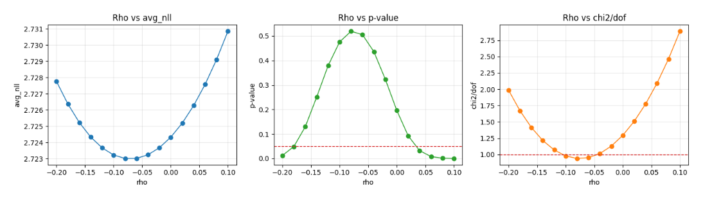
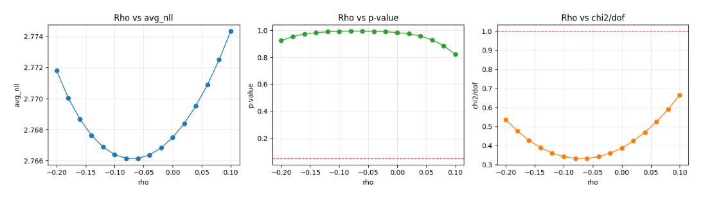

# +lucide:sigma+ Test Pearson χ² dla scoreline

Ten przewodnik wyjaśnia jak w tym projekcie używać
[`pearson_chi2_scoreline_gof`][src.models.evaluation.pearson_chi2_scoreline_gof]
jako diagnostyki kalibracji rozkładu wyników. Narzędzie działa na agregacji
siatki scoreline `4x4` (`0,1,2,3+` dla home i away) z automatycznym merge
rzadkich binów do `Other`.

!!! abstract "Najkrócej"
    - **NLL** służy do strojenia (objective).
    - **Pearson χ²** służy do sprawdzenia zgodności zagregowanego rozkładu z obserwacjami.
    - **PIT** pomaga domknąć interpretację kształtu odchyleń.

## Co mierzy test Pearson χ²

Dla każdego bina porównujemy:

- `O_i` — liczność obserwowaną,
- `E_i` — liczność oczekiwaną z modelu.

Statystyka:

\[
\chi^2 = \sum_{i=1}^{k} \frac{(O_i - E_i)^2}{E_i}
\]

W tym projekcie:

- `E_i` jest sumą prawdopodobieństw z macierzy scoreline po wszystkich meczach,
- `O_i` jest liczbą meczów wpadających do danego bina,
- `k` to liczba binów **po** merge do `Other`.

## Jak działa agregacja 4x4 + Other

Bazowo masz 16 binów:

- home: `0`, `1`, `2`, `3+`,
- away: `0`, `1`, `2`, `3+`.

To daje etykiety typu `h0_a0`, `h1_a3+`, `h3+_a2`. Potem:

1. liczysz `O` i `E` dla wszystkich 16 binów,
2. biny z `E_i < min_expected_threshold` są łączone do `Other`,
3. statystykę χ² liczysz na binach po merge.

To podejście ogranicza problem niestabilnych wkładów dla bardzo rzadkich
kategorii (np. wysokie remisy i skraje rozkładu).

## Interpretacja `chi2_stat`, `dof`, `chi2/dof`, `pvalue`

- `chi2_stat`: im większe, tym większe odchylenie od modelu.
- `dof`: efektywna liczba stopni swobody testu.
- `chi2/dof`: szybki wskaźnik skali odchylenia (okolice `1` zwykle wyglądają zdrowiej).
- `pvalue`: prawdopodobieństwo uzyskania takiej lub większej statystyki przy hipotezie zgodności.

!!! info "Uwaga praktyczna"
    `pvalue` jest czułe na wielkość próby. Przy bardzo dużym `n` nawet małe
    odchylenia mogą dawać niskie wartości. Dlatego czytaj je razem z
    `chi2/dof`, `bins_df` i metryką NLL.

## Dlaczego dzielimy przez `dof`

Sama wartość `chi2_stat` rośnie naturalnie wraz z liczbą binów i stopni
swobody, więc bywa trudno porównać dwa wyniki, jeśli mają różne `dof`
(np. przez inny merge do `Other` albo inną korektę `ddof`).

Dlatego używa się skali znormalizowanej:

\[
\frac{\chi^2}{dof}
\]

Intuicja jest taka:

- przy dobrze dopasowanym modelu i poprawnych założeniach testu,
  oczekiwana wartość \(\chi^2\) jest w przybliżeniu równa `dof`,
- więc \(\chi^2 / dof \approx 1\) oznacza, że skala odchyleń jest „typowa”,
- \(\chi^2 / dof \gg 1\) sugeruje zbyt duże odchylenia (niedopasowanie),
- \(\chi^2 / dof \ll 1\) może sugerować zbyt „gładki” obraz (np. bardzo agresywny merge binów,
  mało informacji po agregacji, albo nietypową strukturę danych).

To nie jest formalny próg decyzyjny, tylko praktyczny wskaźnik diagnostyczny.
Najlepiej interpretować go razem z `pvalue`, `bins_df` i metryką NLL.

## Jak ustawiać `ddof`

Wynik używa:

\[
\text{dof} = k_{final} - 1 - ddof
\]

gdzie `k_final` to liczba binów po merge.

Praktyczna interpretacja:

- `ddof = 0`: najczęściej dla holdout/test, gdy oceniasz model poza próbką,
  na której dobierałeś parametry.
- `ddof > 0`: gdy chcesz skorygować stopnie swobody o parametry estymowane
  na tej samej próbie (np. strojenie `rho` i jednoczesna ocena na tych samych danych).

Rekomendacja do tego repo:

- do porównań produkcyjnych na zbiorze walidacyjnym/holdout zacznij od `ddof=0`,
- jeśli robisz analizę na zbiorze użytym do estymacji, dodaj konserwatywną
  korektę `ddof` i porównuj wyniki wrażliwości.

## Jak użyć w kodzie

Pojedyncza diagnostyka dla jednego `rho`:

```python
import numpy as np
from src.models.components import PoissonMatrixBuilder
from src.models.evaluation import pearson_chi2_scoreline_gof

builder = PoissonMatrixBuilder(rho=-0.06, max_goals_matrix=8)
result = pearson_chi2_scoreline_gof(
    lambda_home=pred_df["exp_goals_home"].to_numpy(),
    lambda_away=pred_df["exp_goals_away"].to_numpy(),
    actual_home=pred_df["home_score"].to_numpy(),
    actual_away=pred_df["away_score"].to_numpy(),
    matrix_builder=builder,
    min_expected_threshold=5.0,
    ddof=0,
)

print(result.chi2_stat, result.dof, result.pvalue)
print(result.bins_df.head())
```

Sweep po `rho` (NLL jako ranking, Pearson χ² jako filtr diagnostyczny):

```python
import numpy as np
import pandas as pd
from src.models.components import PoissonMatrixBuilder, average_scoreline_nll
from src.models.evaluation import pearson_chi2_scoreline_gof

rows = []
rho_grid = np.arange(-0.20, 0.11, 0.02)

lam_h = pred_df["exp_goals_home"].to_numpy()
lam_a = pred_df["exp_goals_away"].to_numpy()
act_h = pred_df["home_score"].to_numpy()
act_a = pred_df["away_score"].to_numpy()

for rho in rho_grid:
    nll, n_used = average_scoreline_nll(
        lam_h, lam_a, act_h, act_a, rho=float(rho), max_goals_matrix=8
    )
    pearson = pearson_chi2_scoreline_gof(
        lambda_home=lam_h,
        lambda_away=lam_a,
        actual_home=act_h,
        actual_away=act_a,
        matrix_builder=PoissonMatrixBuilder(rho=float(rho), max_goals_matrix=8),
        min_expected_threshold=5.0,
        ddof=0,
    )
    rows.append(
        {
            "rho": rho,
            "avg_nll": nll,
            "chi2_stat": pearson.chi2_stat,
            "dof": pearson.dof,
            "chi2_per_dof": pearson.chi2_stat / pearson.dof if pearson.dof > 0 else np.nan,
            "pvalue": pearson.pvalue,
            "n_bins_merged": pearson.n_bins_merged,
            "n_matches_used": n_used,
        }
    )

summary_df = pd.DataFrame(rows).sort_values("avg_nll")
```

## Przykład z notatnika

Poniżej wykres zapisany z
`notebooks/exploration/05_Pearson_Chi2_Diagnostics_Lab.py`.



/// figure-caption
Rysunek 1. Przykładowy sweep po `rho`: lewy panel (NLL) pokazuje jakość
predykcyjną, środkowy (`pvalue`) sygnalizuje zgodność agregatów, prawy
(`chi2/dof`) ułatwia porównanie skali odchyleń. W praktyce: wybór punktu
startuje od minimum NLL, potem jest weryfikowany przez χ² i PIT.
///

## Wpływ liczebności próby: `N=2000` vs `N=400`

Przy dużej próbie (`N=2000`) ten eksperyment zwykle lepiej rozróżnia wartości
`rho`: minimum NLL i diagnostyka χ² częściej wskazują okolice zgodne z
parametrem użytym do generacji danych syntetycznych.

Przy mniejszej próbie (`N=400`) wariancja losowania jest dużo większa, więc:

- `pvalue` bywa wysokie dla szerokiego zakresu `rho`,
- test ma mniejszą moc rozróżniania kandydatów,
- wskazane optimum `rho` może przesuwać się względem `rho_true`.

To jest normalne zachowanie testu przy ograniczonej liczbie obserwacji i nie
oznacza błędu implementacji.



/// figure-caption
Rysunek 2. Ten sam eksperyment przy `N=400`: krzywa `pvalue` pozostaje wysoka
dla wszystkich testowanych `rho`, a minimum NLL nie musi pokrywać się z
`rho_true`. Wniosek: przy małych próbach traktuj χ² jako miękki sygnał
diagnostyczny i opieraj decyzję na łącznej analizie NLL, χ² oraz PIT.
///

## Jak to łączyć z resztą pipeline

- Strojenie i cache: [Grid search i tuning](06-grid-search-and-tuning.md)
- Diagnostyka rozkładu PIT: [Interpretacja PIT i worm plot](07-pit-diagnostics-interpretation.md)
- Pełne sygnatury API: [API — `src.models.evaluation`](../api/evaluation.md)

!!! tip "Workflow roboczy"
    1. Znajdź kandydatów po NLL.  
    2. Sprawdź `chi2/dof`, `pvalue` i `bins_df`.  
    3. Potwierdź wybór diagnostyką PIT na tym samym holdout.
